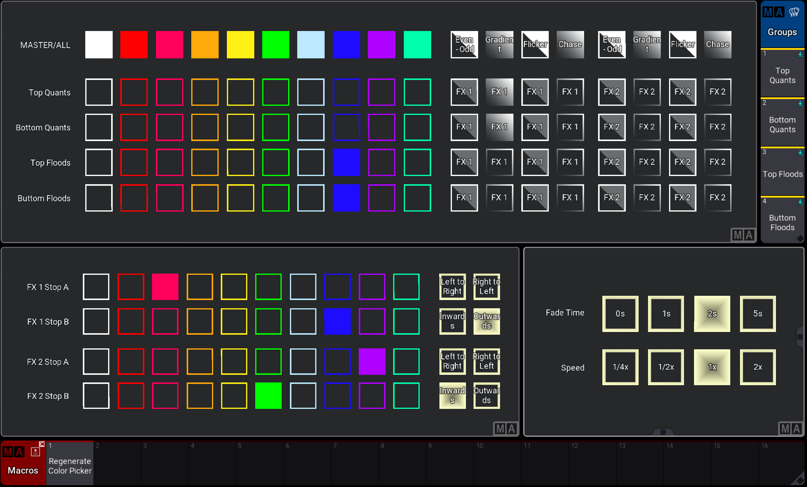

# Busking Tools — grandMA3 Plugin

A grandMA3 plugin for rapidly generating busking show layouts. The goal is to let programmers spin up a full set of interactive color, intensity, beam, and position control layouts — plus a Matricks and Settings page — in minutes instead of hours, without hand-building cues and layouts for every fixture group.

## Status

🚧 **Work in progress.** Only the **Color Picker** component is implemented and usable today. The other components described below are planned and will be added incrementally.

| Component | Status |
|---|---|
| Color Picker | ✅ Implemented / Untested |
| IFX (Intensity FX) | 🔜 Planned |
| BFX (Beam FX) | 🔜 Planned |
| PFX (Position FX) | 🔜 Planned |
| MFX (Master FX) | 🔜 Planned |
| Matricks page | 🔜 Planned |
| Settings page | 🔜 Planned |

## Overview

Busking Tools is built as a single plugin with multiple **components**, each responsible for generating one part of a busking layout:

- **Color Picker** *(available now)* — generates an interactive color-picker layout from your existing Color presets and Groups.
- **IFX** *(planned)* — intensity effect shapes (sine, square, sawtooth, twinkle, etc.), distributed via the Matricks page rather than baked into individual buttons.
- **BFX** *(planned)* — beam attribute control (gobo, prism, focus/zoom/iris) shapes.
- **PFX** *(planned)* — static and dynamic position layouts (fan, block, circle, figure-8, chases, etc.).
- **MFX** *(planned)* — one-press "mood" presets that combine IFX + BFX + PFX + Matricks state across all pools except color.
- **Matricks page** *(planned)* — live control of grouping, direction, phase, speed, and symmetry, shared across the FX pools.
- **Settings page** *(planned)* — wing/group configuration, fade times, and other global show parameters.

Each component is called as a separate plugin index (e.g. `.2` for Color Picker) so new components can be added over time without breaking existing ones.

## Screenshots

Example of the generated Color Picker layout:



## Requirements

- grandMA3 console or onPC
- A showfile with your fixtures already patched

## Installation

1. Copy the contents of this repository into your `gma3_library` folder.
2. In grandMA3, go to the **Show Creator** page and import the plugin.

## Usage — Color Picker

1. Create the **Groups** you want to control, and the **Color presets** you want available, in the Group pool and Color pool (pool 4).
2. Run the plugin component for the Color Picker:
   ```
   Call Plugin 'Busking Tools'.2
   ```
   *(`.2` is the component index for Color Picker — other components will use different indices as they're added.)*
3. In the plugin UI, select the desired options (target groups, presets, layout options, etc.).
4. Press **Generate**.
5. Wait for the process to finish. The generated layout will then be available for use in your show.

## Roadmap

- [x] Color Picker
- [ ] IFX layout generator
- [ ] BFX layout generator
- [ ] PFX layout generator
- [ ] MFX layout generator
- [ ] Matricks control page
- [ ] Settings page (wings, groups, fade times)

## Notes

- Each generated layout relies on existing pool objects (Groups, Presets, Effects) rather than hard-coded values, so layouts stay editable and update if you modify the underlying pool objects.
- Contributions, bug reports, and feature requests are welcome — please open an issue describing the component and behavior involved.
